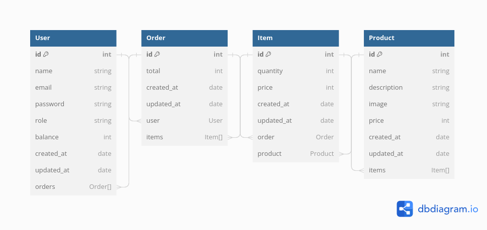

<h1 style="text-align: center;"> Online Store </h1>

An online store application with admin dashboard built with Laravel framework.

### Models Relationship

## Routes 

### Public Routes 

| URL | Method | About | 
| --- | --- | --- | 
| '/' | `GET` | get home page|
| '/about' | `GET` | get about page| 
| '/products' | `GET` |get Prodcuts Page|
| '/products/{id}' | `GET` | get single product page|
| '/cart' | `GET` | get all prodcuts in carts | 
| '/cart/delete' | `GET` | delete all products in cart |
| '/cart/add/{id}'| `POST` | add product to cart|

### Authenticated Routes 

| URL | Method | About | 
| --- | --- | --- | 
| '/cart/purchase' | `GET` | purchase products in cart | 
| '/my-account/orders' | `GET` | get all purchased products | 

### Admin Routes 

| URL | Method | About | 
| --- | --- | --- | 
| '/admin' |`GET`| get admin home page | 
| '/admin/products' | `GET`| list all products for admin | 
| '/admin/products/store' | `POST` | add products to the list of products |
| '/admin/products/{id}/delete' | `delete` | delete a single product |
| '/admin/product/{id}/edit' | `GET` | get editing form for a single product |
| '/admin/product/{id}/update' | `PUT`| edit a single product | 

